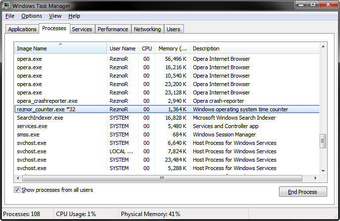
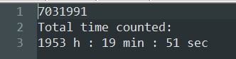

# Reznor Operating System Time Counter
> Simple ninja counter that I've written for counting the operating system time from startup to shutdown.

## General info
Windows application written in C++ Builder 6.0. It's a counter that counts the Windows time from startup till shutdown, and saves it into a .txt file. Each time it opens it reads the last written contents of the file, and starts counting further from where it finished. When no file exists, it creates a new file and starts counting again from 0. The program sits open while launched, but has no window and is not visible in the taskbar or the tray. The only way to close the program is by logging off, shutdown, restart or closing manually through Task Manager.
If you put a shortcut to it in Autostart, it will count all the time over which Windows was running until you decide to remove it.
If you open the .txt file (it's saved in the same folder that the program is) it shows also the Total time counted in hours, minutes and seconds.

### The program has built in safety measures:
* it saves the file periodically each 15 min (to be sure not lose too much progress after some unexpected shutdown)
* it saves the file each time Windows is closing it (at shutdown/restart/logoff)

### Things not to do:
* please don't edit the contents of the .txt file
* please don't launch the program multiple times
* please don't have the .txt file open in editor over a longer period of time while the program is running

## Technologies
* C++
* C++ Builder 6.0 (IDE)

## Screenshots

## Contact
[ReznoRMichael](https://github.com/ReznoRMichael)